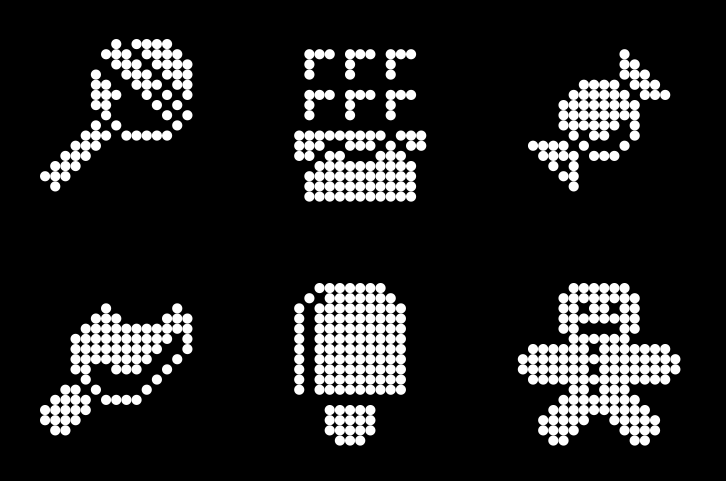

# ndotter

Convert bitmaps to N-dot SVG art

This projects consists of 3 parts:

* [`backend`](backend/) - image processing library
* [`cli`](cli/) - command line frontend
* [`gui`](gui/) - gui frontend
